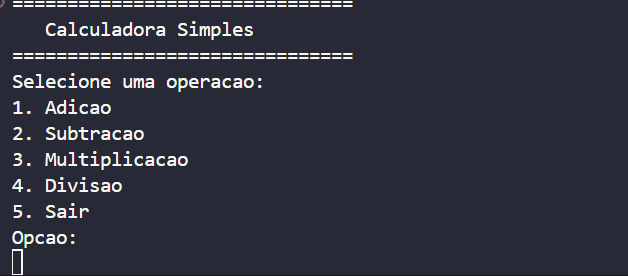

# Calculadora Simples em C

Este projeto é uma **calculadora simples desenvolvida em linguagem C**, que permite realizar operações matemáticas básicas diretamente pelo terminal.  
O programa apresenta um menu interativo onde o usuário pode escolher a operação desejada, inserir dois números e visualizar o resultado.

As operações disponíveis são:
- Adição
- Subtração
- Multiplicação
- Divisão (com tratamento de erro para divisão por zero)

O sistema também pergunta ao usuário se deseja realizar outra operação ou encerrar o programa.

---

## Demonstração

Abaixo está uma demonstração do funcionamento do programa no terminal:



---

## Instalação e Pré-requisitos

### Pré-requisitos

Para compilar e executar este projeto, você precisa ter:
- Um sistema operacional compatível (Windows, Linux ou macOS)
- Um compilador C instalado (como **GCC**)

Para verificar se o GCC está instalado, utilize:
```bash
gcc --version
```

### Instalação

1. Clone esse repositório:
```bash
https://github.com/Joaopedro01dev/Calculadora-em-C.git
```
2. Acesse o diretório do projeto:
```bash
cd Calculadora-em-C
```
3. Compile o código-fonte:
```bash
gcc main.c -o calculadora
```
4. Execute o programa:
```bash
./calculadora
```
No Windows(PowerShell ou CMD):
```bash
calculadora.exe
```

## Uso e Exemplos
Ao executar o programa, será exibido um menu semelhante a este:
```bash
===============================
   Calculadora Simples
===============================
Selecione uma operacao:
1. Adicao
2. Subtracao
3. Multiplicacao
4. Divisao
5. Sair
Opcao:
```
### Exemplo de uso (Adição)
Entrada do usuário:
```yaml
opcao: 1
Digite o primeiro numero: 5
Digite o segundo numero: 3
```
Sáida:
```bash
Resultado: 5.00 + 3.00 = 8.00
Deseja realizar outra operacao? (s/n):
```
## Estrutura do Projeto
A estrutura do projeto está organizada da seguinte forma:
```bash
Calculadora-em-C/
│
├── main.c
├── README.md
├── LICENSE
│
└── assets
      └── demo.gif
```
## Licença
Este projeto está licenciado sob a **Licença MIT**.

Isso significa que qualquer pessoa pode usar, copiar, modificar e distribuir este software, desde que mantenha os avisos de direitos autorais.

Para mais detalhes, consulte o arquivo [LICENSE](LICENSE).
